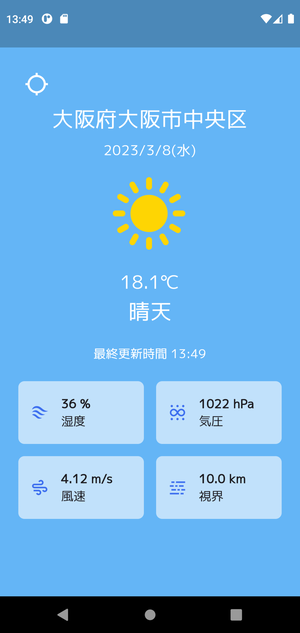

# weather_app

OpenWeatherMap を利用した天気予報アプリ。

## 画面



## 利用パッケージ

* [envied](https://pub.dev/packages/envied)
* [geolocator](https://pub.dev/packages/geolocator)
* [geocoding](https://pub.dev/packages/geocoding)
* [flutter_riverpod](https://pub.dev/packages/flutter_riverpod)
* [dio](https://pub.dev/packages/dio)
* [freezed](https://pub.dev/packages/freezed)
* [flutter_svg](https://pub.dev/packages/flutter_svg)
* [intl](https://pub.dev/packages/intl)
* [google_fonts](https://pub.dev/packages/google_fonts)


## AndroidManifest.xml に追加するパーミッション

```
<uses-permission android:name="android.permission.INTERNET"/>
<uses-permission android:name="android.permission.ACCESS_FINE_LOCATION" />
<uses-permission android:name="android.permission.ACCESS_COARSE_LOCATION" />
```

## 注意点

APIキーを .evn ファイルに保存し、 [ENVied パッケージ](https://pub.dev/packages/envied) を利用してAPIキーを読み込んでいる。

そのため、プロジェクトルートフォルダにある .env_sample ファイルを .env へリネームして API キーを入力する。

* 現在の .env_sample ファイル

  ```
  OPENWEATHER_KEY=<your api key>
  ```

* .env へリネームしてAPIキーを入力

  ```
  OPENWEATHER_KEY=abcdefg12345
  ```

* build_runner を利用して env.g.dart ファイルを生成する

  ```
  $ flutter pub run build_runner build --delete-conflicting-outputs
  ```

